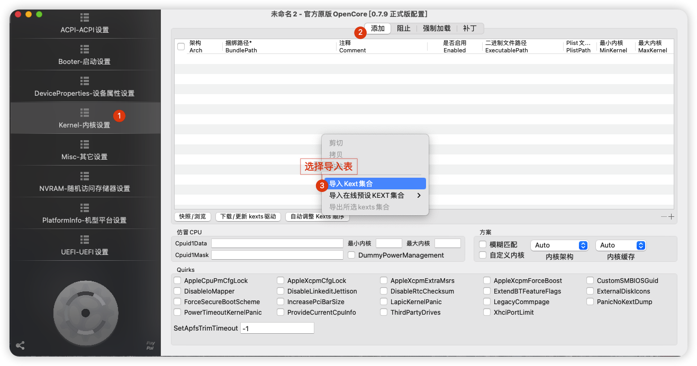
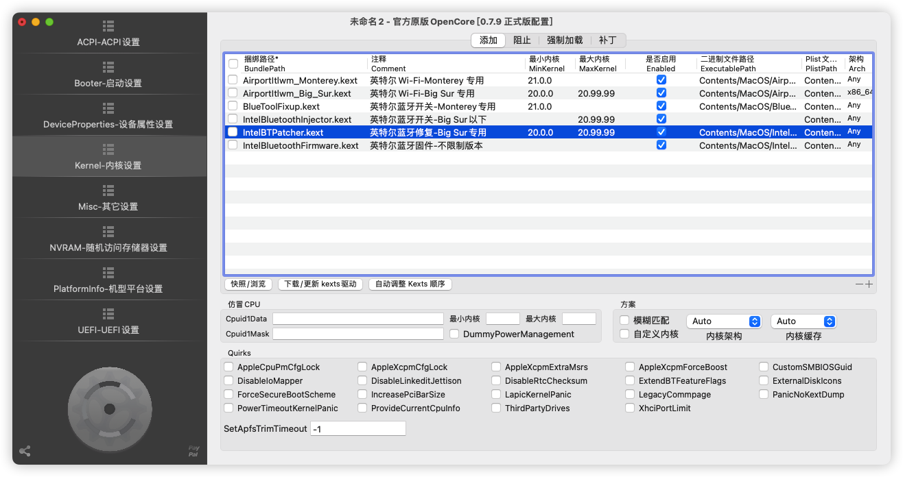
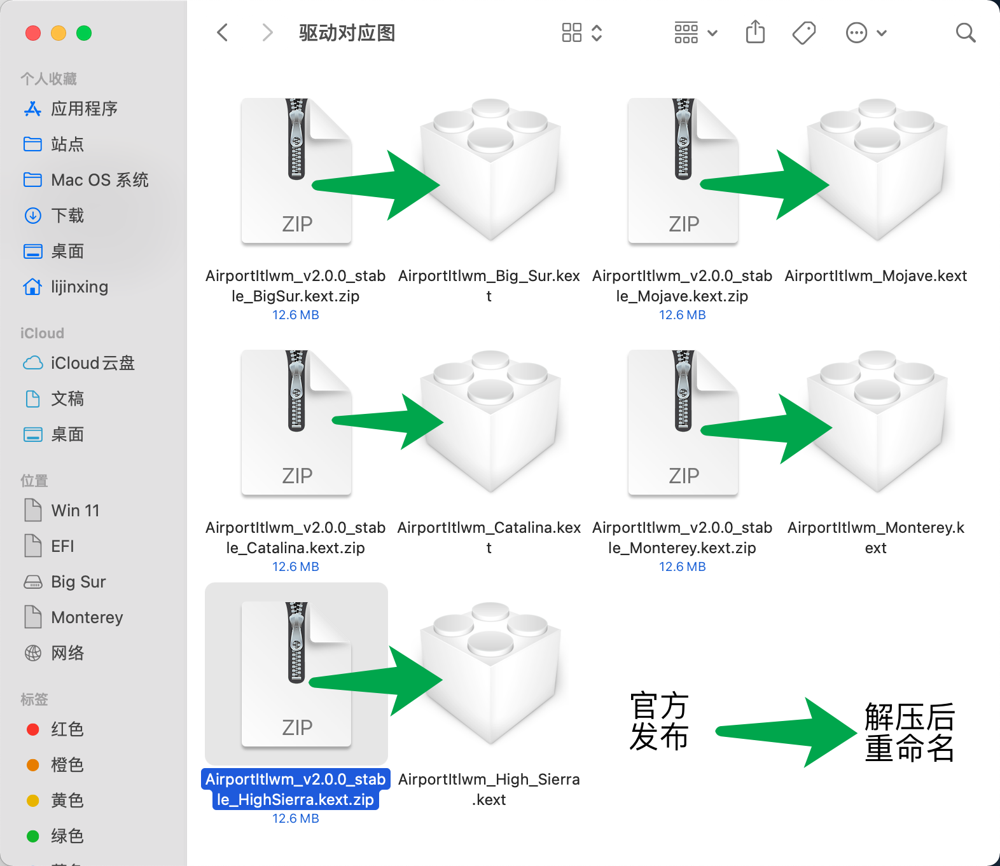

# 说明

- 自2.0我自用设备已更换免驱网卡，故不再内置网卡驱动，如有需要请自行导入。

# 导入教学

1. 将以下驱动，放置「/EFI/OC/Kexts」目录
   - AirportItlwm_Big_Sur.kext
   - AirportItlwm_Monterey.kext
   - BlueToolFixup.kext
   - IntelBluetoothFirmware.kext
   - IntelBluetoothInjector.kext
   - IntelBTPatcher.kext
2. **使用「OpenCore Configurator」打开「Config.plist」并导入网卡加载表**

3. 驱动更新对应表

